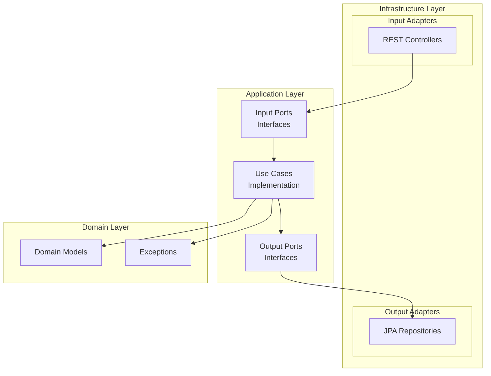
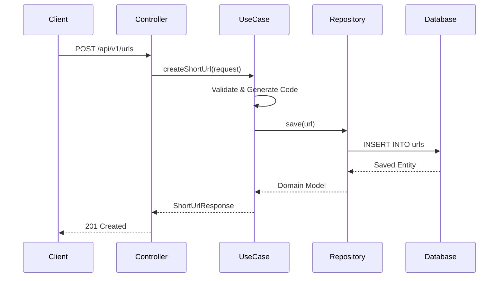
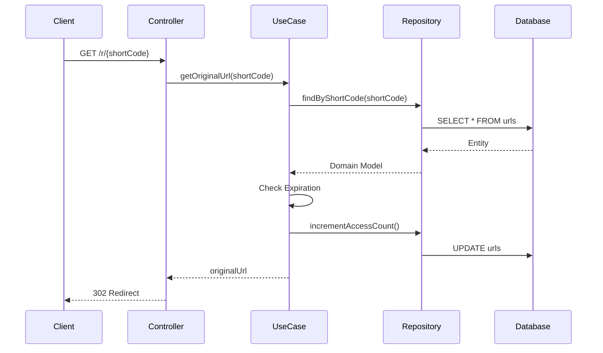

# URL Shortener

A URL shortening service built with Java and Spring Boot, demonstrating clean architecture principles and modern development practices.

## 🌐 Live Demo

| Resource | URL |
|----------|-----|
| **API Base URL** | https://url.ivanhernandez.dev |
| **Swagger UI (API Docs)** | https://url.ivanhernandez.dev/swagger-ui/index.html |
| **OpenAPI Spec** | https://url.ivanhernandez.dev/v3/api-docs |

**Try it now:**

```bash
curl -X POST https://url.ivanhernandez.dev/api/v1/urls \
  -H "Content-Type: application/json" \
  -d '{"originalUrl": "https://github.com"}'
```

---

## 🎯 Skills Demonstrated

| Skill | Implementation |
|-------|----------------|
| **Hexagonal Architecture** | Clear separation between domain, application, and infrastructure layers using ports & adapters pattern |
| **SOLID Principles** | Single responsibility per class, dependency inversion via interfaces, interface segregation with specific use cases |
| **Domain-Driven Design** | Rich domain model with business logic encapsulation |
| **Clean Code** | Readable, maintainable, and testable code structure |
| **DTOs with Named Constructors** | `fromDomain()` and `toDomain()` methods for clean object mapping without external libraries |
| **Custom Exceptions** | Domain-specific exceptions (`UrlNotFoundException`, `ExpiredUrlException`, `InvalidUrlException`) |
| **Global Exception Handling** | Centralized `@RestControllerAdvice` for consistent error responses across the API |
| **Input Validation** | Bean Validation with `@Valid`, `@NotBlank`, `@URL` annotations and custom error messages |
| **RESTful API Design** | Proper HTTP methods, status codes, and resource naming |
| **Spring Boot** | Spring Web, Spring Data JPA, Bean Validation |
| **Database Flexibility** | H2 for development, PostgreSQL for production |
| **API Documentation** | OpenAPI/Swagger integration |
| **Containerization** | Docker & Docker Compose for deployment |

---

## 🏗️ Hexagonal Architecture

The project follows Hexagonal Architecture (Ports & Adapters) to ensure a clean separation of concerns:



### Layer Responsibilities

| Layer | Responsibility | Dependencies |
|-------|----------------|--------------|
| **Domain** | Business logic, entities, domain exceptions | None (pure Java) |
| **Application** | Use cases, orchestration, DTOs, port interfaces | Domain only |
| **Infrastructure** | Controllers, repositories, external services | Application & Domain |

### Why Hexagonal?

- **Testability**: Domain and application layers can be unit tested without infrastructure
- **Flexibility**: Swap databases, frameworks, or APIs without changing business logic
- **Maintainability**: Clear boundaries make the codebase easier to understand

### Project Structure

```
src/main/java/dev/ivanhernandez/urlshortener/
│
├── UrlShortenerApplication.java        # Spring Boot main class
│
├── domain/                             # Domain Layer
│   ├── model/
│   │   └── Url.java                    # Domain model
│   └── exception/
│       ├── UrlNotFoundException.java
│       ├── InvalidUrlException.java
│       └── ExpiredUrlException.java
│
├── application/                        # Application Layer
│   ├── port/
│   │   ├── input/                      # Use case interfaces
│   │   │   ├── CreateShortUrlUseCase.java
│   │   │   ├── GetOriginalUrlUseCase.java
│   │   │   ├── GetUrlStatsUseCase.java
│   │   │   └── DeleteUrlUseCase.java
│   │   └── output/
│   │       └── UrlRepository.java      # Repository interface
│   ├── usecase/                        # Use case implementations
│   │   ├── CreateShortUrlUseCaseImpl.java
│   │   ├── GetOriginalUrlUseCaseImpl.java
│   │   ├── GetUrlStatsUseCaseImpl.java
│   │   └── DeleteUrlUseCaseImpl.java
│   └── dto/
│       ├── request/
│       │   └── CreateUrlRequest.java
│       └── response/
│           ├── ShortUrlResponse.java
│           ├── UrlStatsResponse.java
│           ├── ErrorResponse.java
│           └── ValidationErrorResponse.java
│
└── infrastructure/                     # Infrastructure Layer
    ├── adapter/
    │   ├── input/rest/
    │   │   ├── UrlController.java
    │   │   └── RedirectController.java
    │   └── output/persistence/
    │       ├── JpaUrlRepository.java
    │       ├── SpringDataUrlRepository.java
    │       └── UrlJpaEntity.java
    ├── config/
    │   └── OpenApiConfig.java
    └── exception/
        └── GlobalExceptionHandler.java
```

---

## 🔄 DTOs with Named Constructors

Instead of using external mapping libraries (MapStruct, ModelMapper), this project uses **named constructors** for clean, explicit object mapping:

### Response DTO Example

```java
public record ShortUrlResponse(
        String shortUrl,
        String shortCode,
        String originalUrl,
        LocalDateTime createdAt,
        LocalDateTime expiresAt
) {
    public static ShortUrlResponse fromDomain(Url url, String baseUrl) {
        return new ShortUrlResponse(
                baseUrl + "/r/" + url.shortCode(),
                url.shortCode(),
                url.originalUrl(),
                url.createdAt(),
                url.expiresAt()
        );
    }
}
```

### JPA Entity Example

```java
@Entity
@Table(name = "urls")
public class UrlJpaEntity {
    @Id
    @GeneratedValue(strategy = GenerationType.IDENTITY)
    private Long id;
    private String originalUrl;
    private String shortCode;
    // ... other fields

    public static UrlJpaEntity fromDomain(Url url) {
        UrlJpaEntity entity = new UrlJpaEntity();
        entity.id = url.id();
        entity.originalUrl = url.originalUrl();
        entity.shortCode = url.shortCode();
        // ... map other fields
        return entity;
    }

    public Url toDomain() {
        return new Url(id, originalUrl, shortCode, createdAt, 
                       expiresAt, accessCount, lastAccessedAt);
    }
}
```

### Benefits

| Approach | Pros |
|----------|------|
| **Named Constructors** | Explicit, type-safe, no reflection, easy to debug, no external dependencies |
| **External Mappers** | Less boilerplate, automatic mapping |

---

## ⚠️ Custom Exceptions

Domain-specific exceptions provide clear error semantics and enable proper HTTP status mapping:

### Exception Hierarchy

```java
// Thrown when a short code doesn't exist
public class UrlNotFoundException extends RuntimeException {
    public UrlNotFoundException(String shortCode) {
        super("URL not found with code: " + shortCode);
    }
}

// Thrown when accessing an expired URL
public class ExpiredUrlException extends RuntimeException {
    public ExpiredUrlException(String shortCode) {
        super("URL has expired: " + shortCode);
    }
}

// Thrown for invalid URL formats
public class InvalidUrlException extends RuntimeException {
    public InvalidUrlException(String message) {
        super(message);
    }
}
```

### Usage in Use Cases

```java
@Service
public class GetOriginalUrlUseCaseImpl implements GetOriginalUrlUseCase {
    
    @Override
    public String getOriginalUrl(String shortCode) {
        Url url = repository.findByShortCode(shortCode)
                .orElseThrow(() -> new UrlNotFoundException(shortCode));
        
        if (url.isExpired()) {
            throw new ExpiredUrlException(shortCode);
        }
        
        repository.incrementAccessCount(shortCode);
        return url.originalUrl();
    }
}
```

---

## 🛡️ Global Exception Handling

A centralized `@RestControllerAdvice` catches all exceptions and returns consistent JSON error responses:

### GlobalExceptionHandler

```java
@RestControllerAdvice
public class GlobalExceptionHandler {

    @ExceptionHandler(UrlNotFoundException.class)
    @ResponseStatus(HttpStatus.NOT_FOUND)
    public ErrorResponse handleUrlNotFound(UrlNotFoundException ex) {
        return new ErrorResponse(404, ex.getMessage(), LocalDateTime.now());
    }

    @ExceptionHandler(ExpiredUrlException.class)
    @ResponseStatus(HttpStatus.GONE)
    public ErrorResponse handleExpiredUrl(ExpiredUrlException ex) {
        return new ErrorResponse(410, ex.getMessage(), LocalDateTime.now());
    }

    @ExceptionHandler(MethodArgumentNotValidException.class)
    @ResponseStatus(HttpStatus.BAD_REQUEST)
    public ValidationErrorResponse handleValidation(MethodArgumentNotValidException ex) {
        Map<String, String> errors = new HashMap<>();
        ex.getBindingResult().getFieldErrors()
            .forEach(error -> errors.put(error.getField(), error.getDefaultMessage()));
        return new ValidationErrorResponse(400, "Validation failed", errors, LocalDateTime.now());
    }
}
```

### Error Response DTOs

```java
public record ErrorResponse(
        int status,
        String message,
        LocalDateTime timestamp
) {}

public record ValidationErrorResponse(
        int status,
        String message,
        Map<String, String> errors,
        LocalDateTime timestamp
) {}
```

### HTTP Status Mapping

| Exception | HTTP Status | When |
|-----------|-------------|------|
| `UrlNotFoundException` | `404 Not Found` | Short code doesn't exist |
| `ExpiredUrlException` | `410 Gone` | URL has expired |
| `MethodArgumentNotValidException` | `400 Bad Request` | Validation failed |
| `InvalidUrlException` | `400 Bad Request` | Malformed URL |

---

## ✅ Input Validation

Validation is implemented using Jakarta Bean Validation annotations with custom error messages:

### Request DTO

```java
public record CreateUrlRequest(
        @NotBlank(message = "Original URL is required")
        @URL(message = "Invalid URL format")
        String originalUrl,

        @Pattern(regexp = "^[a-zA-Z0-9-_]*$", message = "Alias can only contain letters, numbers, hyphens and underscores")
        String customAlias,

        LocalDateTime expiresAt
) {}
```

### Controller Integration

```java
@PostMapping
@ResponseStatus(HttpStatus.CREATED)
public ShortUrlResponse createShortUrl(@Valid @RequestBody CreateUrlRequest request) {
    return createShortUrlUseCase.createShortUrl(request);
}
```

### Validation Error Response

```json
{
  "status": 400,
  "message": "Validation failed",
  "errors": {
    "originalUrl": "Invalid URL format",
    "customAlias": "Alias can only contain letters, numbers, hyphens and underscores"
  },
  "timestamp": "2026-01-11T10:30:00"
}
```

---

## 📡 API Endpoints

| Method | Endpoint | Description |
|--------|----------|-------------|
| `POST` | `/api/v1/urls` | Create a short URL |
| `GET` | `/r/{shortCode}` | Redirect to original URL |
| `GET` | `/api/v1/urls/{shortCode}/stats` | Get URL statistics |
| `DELETE` | `/api/v1/urls/{shortCode}` | Delete a short URL |

### Example: Create Short URL

**Request:**
```bash
curl -X POST https://url.ivanhernandez.dev/api/v1/urls \
  -H "Content-Type: application/json" \
  -d '{
    "originalUrl": "https://github.com/spring-projects/spring-boot",
    "customAlias": "spring",
    "expiresAt": "2026-12-31T23:59:59"
  }'
```

**Response:**
```json
{
  "shortUrl": "https://url.ivanhernandez.dev/r/spring",
  "shortCode": "spring",
  "originalUrl": "https://github.com/spring-projects/spring-boot",
  "createdAt": "2026-01-11T10:30:00",
  "expiresAt": "2026-12-31T23:59:59"
}
```

### Example: Get Statistics

**Request:**
```bash
curl https://url.ivanhernandez.dev/api/v1/urls/spring/stats
```

**Response:**
```json
{
  "shortCode": "spring",
  "originalUrl": "https://github.com/spring-projects/spring-boot",
  "accessCount": 42,
  "createdAt": "2026-01-11T10:30:00",
  "lastAccessedAt": "2026-01-11T15:45:00"
}
```

---

## 🔄 Data Flow

### Create Short URL



### Redirect



---

## 🔧 Technologies

| Category | Technology |
|----------|------------|
| Language | Java 25 |
| Framework | Spring Boot 3.5 |
| Persistence | Spring Data JPA |
| Database (Dev) | H2 |
| Database (Prod) | PostgreSQL |
| Documentation | SpringDoc OpenAPI |
| Build | Maven |
| Containerization | Docker, Docker Compose |

---

## 🚀 Running Locally

### Prerequisites

- Java 25
- Maven 3.9+

### Development Mode (H2)

```bash
mvn spring-boot:run -Dspring-boot.run.profiles=dev
```

### Docker Deployment

```bash
docker-compose up -d
```

This will:
- Start PostgreSQL database
- Automatically create the database schema
- Start the application on port 8081

### Local URLs

| Resource | URL |
|----------|-----|
| Swagger UI | http://localhost:8081/swagger-ui/index.html |
| H2 Console | http://localhost:8081/h2-console (dev profile) |

---

## 📊 Database Schema

```sql
CREATE TABLE urls (
    id               BIGSERIAL PRIMARY KEY,
    original_url     VARCHAR(2048) NOT NULL,
    short_code       VARCHAR(20) NOT NULL UNIQUE,
    created_at       TIMESTAMP NOT NULL DEFAULT CURRENT_TIMESTAMP,
    expires_at       TIMESTAMP,
    access_count     BIGINT NOT NULL DEFAULT 0,
    last_accessed_at TIMESTAMP
);

CREATE INDEX idx_short_code ON urls(short_code);
CREATE INDEX idx_expires_at ON urls(expires_at);
```

---

## 📝 License

This project is licensed under the **Creative Commons Attribution-NonCommercial 4.0 International License (CC BY-NC 4.0)**.

- ✅ Share and adapt the material
- ✅ Give appropriate credit
- ❌ Commercial use not permitted

[](https://creativecommons.org/licenses/by-nc/4.0/)
