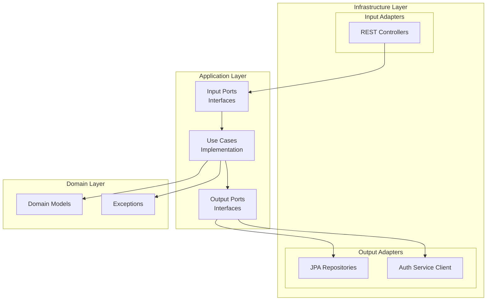
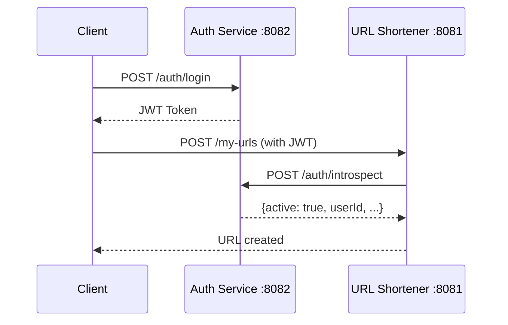

# URL Shortener

A URL shortening service built with Java and Spring Boot, demonstrating clean architecture principles, comprehensive testing strategies, and modern development practices.

## 🌐 Live Demo

| Resource | URL |
|----------|-----|
| **API Base URL** | `https://url.ivanhernandez.dev` |
| **Swagger UI (API Docs)** | https://url.ivanhernandez.dev/swagger-ui/index.html |
| **OpenAPI Spec** | https://url.ivanhernandez.dev/v3/api-docs |

**Try it now:**

```bash
curl -X POST https://url.ivanhernandez.dev/api/v1/urls \
  -H "Content-Type: application/json" \
  -d '{"originalUrl": "https://github.com"}'
```

---

## 🎯 Skills Demonstrated

| Skill | Implementation |
|-------|----------------|
| **Hexagonal Architecture** | Clear separation between domain, application, and infrastructure layers using ports & adapters pattern |
| **SOLID Principles** | Single responsibility per class, dependency inversion via interfaces, interface segregation with specific use cases |
| **Domain-Driven Design** | Rich domain model with business logic encapsulation |
| **Clean Code** | Readable, maintainable, and testable code structure |
| **Token Introspection** | Integration with Auth Service for JWT validation without shared secrets |
| **DTOs with Named Constructors** | `fromDomain()` and `toDomain()` methods for clean object mapping without external libraries |
| **Custom Exceptions** | Domain-specific exceptions (`UrlNotFoundException`, `ExpiredUrlException`, `UrlOwnershipException`) |
| **Global Exception Handling** | Centralized `@RestControllerAdvice` for consistent error responses across the API |
| **Input Validation** | Bean Validation with `@Valid`, `@NotBlank`, `@URL` annotations and custom error messages |
| **RESTful API Design** | Proper HTTP methods, status codes, and resource naming |
| **Spring Boot** | Spring Web, Spring Data JPA, Spring Security, Bean Validation |
| **Database Flexibility** | H2 for development, PostgreSQL for production |
| **API Documentation** | OpenAPI/Swagger integration with JWT support |
| **Containerization** | Docker & Docker Compose for deployment |
| **Testing** | Unit, integration, and end-to-end tests with JUnit 5, Mockito, and Spring Boot Test |

---

## 🏗️ Hexagonal Architecture

The project follows Hexagonal Architecture (Ports & Adapters) to ensure a clean separation of concerns:



### Layer Responsibilities

| Layer | Responsibility | Dependencies |
|-------|----------------|--------------|
| **Domain** | Business logic, entities, domain exceptions | None (pure Java) |
| **Application** | Use cases, orchestration, DTOs, port interfaces | Domain only |
| **Infrastructure** | Controllers, repositories, external services | Application & Domain |

### Why Hexagonal?

- **Testability**: Domain and application layers can be unit tested without infrastructure
- **Flexibility**: Swap databases, frameworks, or APIs without changing business logic
- **Maintainability**: Clear boundaries make the codebase easier to understand

### Project Structure

```
src/main/java/dev/ivanhernandez/urlshortener/
│
├── UrlShortenerApplication.java
│
├── domain/
│   ├── model/
│   │   └── Url.java
│   └── exception/
│       ├── UrlNotFoundException.java
│       ├── InvalidUrlException.java
│       ├── ExpiredUrlException.java
│       └── UrlOwnershipException.java
│
├── application/
│   ├── port/
│   │   ├── input/
│   │   │   ├── CreateShortUrlUseCase.java
│   │   │   ├── CreateUserUrlUseCase.java
│   │   │   ├── GetOriginalUrlUseCase.java
│   │   │   ├── GetUrlStatsUseCase.java
│   │   │   ├── GetUserUrlStatsUseCase.java
│   │   │   ├── GetUserUrlsUseCase.java
│   │   │   ├── DeleteUrlUseCase.java
│   │   │   └── DeleteUserUrlUseCase.java
│   │   └── output/
│   │       └── UrlRepository.java
│   ├── usecase/
│   │   ├── CreateShortUrlUseCaseImpl.java
│   │   ├── CreateUserUrlUseCaseImpl.java
│   │   ├── GetOriginalUrlUseCaseImpl.java
│   │   ├── GetUrlStatsUseCaseImpl.java
│   │   ├── GetUserUrlStatsUseCaseImpl.java
│   │   ├── GetUserUrlsUseCaseImpl.java
│   │   ├── DeleteUrlUseCaseImpl.java
│   │   └── DeleteUserUrlUseCaseImpl.java
│   └── dto/
│       ├── request/
│       │   └── CreateUrlRequest.java
│       └── response/
│           ├── ShortUrlResponse.java
│           ├── UrlStatsResponse.java
│           ├── ErrorResponse.java
│           └── ValidationErrorResponse.java
│
└── infrastructure/
    ├── adapter/
    │   ├── input/rest/
    │   │   ├── UrlController.java
    │   │   ├── MyUrlsController.java
    │   │   └── RedirectController.java
    │   └── output/
    │       ├── persistence/
    │       │   ├── JpaUrlRepository.java
    │       │   ├── SpringDataUrlRepository.java
    │       │   └── UrlJpaEntity.java
    │       └── auth/
    │           ├── AuthServiceClient.java
    │           └── IntrospectResponse.java
    ├── config/
    │   ├── SecurityConfig.java
    │   ├── JwtAuthenticationFilter.java
    │   ├── AuthenticatedUser.java
    │   └── OpenApiConfig.java
    └── exception/
        └── GlobalExceptionHandler.java
```

---

## 🔐 Authentication Integration

This service integrates with the [Auth Service](../authentication-service) for user authentication using **Token Introspection**. No shared secrets required.

### How it Works



### Anonymous vs Authenticated

| Feature | Anonymous | Authenticated |
|---------|-----------|---------------|
| Create URL | ✅ `/api/v1/urls` | ✅ `/api/v1/my-urls` |
| Delete URL | ✅ (only anonymous URLs) | ✅ (only my URLs) |
| Custom alias | ✅ | ✅ |
| View statistics | ❌ | ✅ |
| List my URLs | ❌ | ✅ |

### Security Rules

| Action | Rule |
|--------|------|
| Delete anonymous URL | ✅ Allowed via public endpoint |
| Delete URL with owner publicly | ❌ 403 Forbidden |
| Delete another user's URL | ❌ 404 Not Found |
| View stats of another user's URL | ❌ 404 Not Found |

### Using with Auth Service

```bash
# 1. Get token from Auth Service
curl -X POST http://localhost:8082/api/v1/auth/login \
  -H "Content-Type: application/json" \
  -d '{"tenantSlug": "acme", "email": "user@example.com", "password": "SecurePass123!"}'

# 2. Use token in URL Shortener
curl -X POST http://localhost:8081/api/v1/my-urls \
  -H "Authorization: Bearer <access_token>" \
  -H "Content-Type: application/json" \
  -d '{"originalUrl": "https://github.com"}'

# 3. View statistics
curl http://localhost:8081/api/v1/my-urls/<shortCode>/stats \
  -H "Authorization: Bearer <access_token>"
```

---

## 📡 API Endpoints

### Public Endpoints

| Method | Endpoint | Description |
|--------|----------|-------------|
| `POST` | `/api/v1/urls` | Create a short URL (anonymous) |
| `DELETE` | `/api/v1/urls/{shortCode}` | Delete an anonymous URL |
| `GET` | `/r/{shortCode}` | Redirect to original URL |

### Protected Endpoints (require JWT)

| Method | Endpoint | Description |
|--------|----------|-------------|
| `GET` | `/api/v1/my-urls` | List my URLs |
| `POST` | `/api/v1/my-urls` | Create URL linked to my account |
| `DELETE` | `/api/v1/my-urls/{shortCode}` | Delete my URL |
| `GET` | `/api/v1/my-urls/{shortCode}/stats` | Get URL statistics |

### Example: Create Short URL

**Request:**
```bash
curl -X POST https://url.ivanhernandez.dev/api/v1/urls \
  -H "Content-Type: application/json" \
  -d '{
    "originalUrl": "https://github.com/spring-projects/spring-boot",
    "customAlias": "spring",
    "expiresAt": "2026-12-31T23:59:59"
  }'
```

**Response:**
```json
{
  "shortUrl": "https://url.ivanhernandez.dev/r/spring",
  "shortCode": "spring",
  "originalUrl": "https://github.com/spring-projects/spring-boot",
  "createdAt": "2026-01-11T10:30:00",
  "expiresAt": "2026-12-31T23:59:59"
}
```

### Example: Get Statistics (Authenticated)

**Request:**
```bash
curl https://url.ivanhernandez.dev/api/v1/my-urls/spring/stats \
  -H "Authorization: Bearer <access_token>"
```

**Response:**
```json
{
  "shortCode": "spring",
  "originalUrl": "https://github.com/spring-projects/spring-boot",
  "accessCount": 42,
  "createdAt": "2026-01-11T10:30:00",
  "lastAccessedAt": "2026-01-11T15:45:00"
}
```

---

## ⚠️ Custom Exceptions

Domain-specific exceptions provide clear error semantics and enable proper HTTP status mapping:

| Exception | HTTP Status | When |
|-----------|-------------|------|
| `UrlNotFoundException` | `404 Not Found` | Short code doesn't exist |
| `ExpiredUrlException` | `410 Gone` | URL has expired |
| `InvalidUrlException` | `400 Bad Request` | Malformed URL or alias exists |
| `UrlOwnershipException` | `403 Forbidden` | Trying to delete a URL that belongs to a user via public endpoint |

---

## 🔧 Technologies

| Category | Technology |
|----------|------------|
| Language | Java 25 |
| Framework | Spring Boot 3.5 |
| Security | Spring Security + Token Introspection |
| Persistence | Spring Data JPA |
| Database (Dev) | H2 |
| Database (Prod) | PostgreSQL |
| Documentation | SpringDoc OpenAPI |
| Build | Maven |
| Containerization | Docker, Docker Compose |

---

## 🚀 Running Locally

### Prerequisites

- Java 25
- Maven 3.9+

### Development Mode (H2)

```bash
mvn spring-boot:run -Dspring-boot.run.profiles=dev
```

### Docker Deployment

```bash
docker-compose up -d
```

This will:
- Start PostgreSQL database
- Automatically create the database schema
- Start the application on port 8081

### Environment Variables

| Variable | Description | Required |
|----------|-------------|----------|
| `AUTH_SERVICE_URL` | URL of the Auth Service (default: http://localhost:8082) | Yes (prod) |
| `APP_BASE_URL` | Base URL for generated short links | No |
| `DB_HOST`, `DB_PORT`, `DB_NAME` | PostgreSQL connection | Yes (prod) |
| `DB_USERNAME`, `DB_PASSWORD` | PostgreSQL credentials | Yes (prod) |

### Local URLs

| Resource | URL |
|----------|-----|
| Swagger UI | http://localhost:8081/swagger-ui/index.html |
| H2 Console | http://localhost:8081/h2-console (dev profile) |

---

## 📊 Database Schema

```sql
CREATE TABLE urls (
    id               BIGSERIAL PRIMARY KEY,
    original_url     VARCHAR(2048) NOT NULL,
    short_code       VARCHAR(20) NOT NULL UNIQUE,
    user_id          UUID,
    tenant_id        UUID,
    created_at       TIMESTAMP NOT NULL DEFAULT CURRENT_TIMESTAMP,
    expires_at       TIMESTAMP,
    access_count     BIGINT NOT NULL DEFAULT 0,
    last_accessed_at TIMESTAMP
);

CREATE INDEX idx_short_code ON urls(short_code);
CREATE INDEX idx_expires_at ON urls(expires_at);
CREATE INDEX idx_user_id ON urls(user_id);
```

---

## 🧪 Testing

The project includes comprehensive tests following best practices:

### Test Structure

```
src/test/java/dev/ivanhernandez/urlshortener/
│
├── domain/
│   ├── model/
│   │   ├── UrlTest.java
│   │   └── UrlParameterizedTest.java
│   └── exception/
│       └── DomainExceptionsTest.java
│
├── application/
│   ├── usecase/
│   │   ├── CreateShortUrlUseCaseImplTest.java
│   │   ├── CreateShortUrlUseCaseImplEdgeCasesTest.java
│   │   ├── GetOriginalUrlUseCaseImplTest.java
│   │   ├── GetUrlStatsUseCaseImplTest.java
│   │   ├── GetUserUrlStatsUseCaseImplTest.java
│   │   └── DeleteUrlUseCaseImplTest.java
│   └── dto/
│       ├── request/
│       │   └── CreateUrlRequestValidationTest.java
│       └── response/
│           ├── ShortUrlResponseTest.java
│           └── UrlStatsResponseTest.java
│
├── infrastructure/
│   ├── adapter/input/rest/
│   │   ├── UrlControllerTest.java
│   │   ├── UrlControllerValidationTest.java
│   │   └── RedirectControllerTest.java
│   ├── adapter/output/persistence/
│   │   ├── UrlJpaEntityTest.java
│   │   ├── JpaUrlRepositoryTest.java
│   │   └── SpringDataUrlRepositoryTest.java
│   └── exception/
│       └── GlobalExceptionHandlerTest.java
│
└── UrlShortenerIntegrationTest.java
```

### Running Tests

```bash
mvn test
```

---

## 📝 License

This project is licensed under the **Creative Commons Attribution-NonCommercial 4.0 International License (CC BY-NC 4.0)**.

- ✅ Share and adapt the material
- ✅ Give appropriate credit
- ❌ Commercial use not permitted

[](https://creativecommons.org/licenses/by-nc/4.0/)
